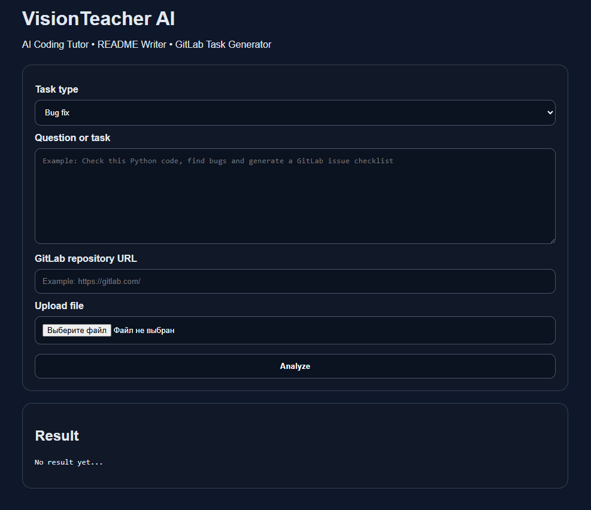

# VisionTeacher AI

<p align="center">
  
</p>

<p align="center">
  <b>AI Coding Tutor • GitLab Project Analyzer • README Generator</b>
</p>

<p align="center">
  VisionTeacher AI helps developers, students and teachers understand repositories faster using AI.
</p>

---

# 🚀 VisionTeacher AI

**VisionTeacher AI** is an AI-powered development assistant designed for **hackathons, students, and educators**.

It analyzes GitLab repositories, explains code, generates documentation, and helps developers understand unfamiliar projects quickly using **Google Gemini AI**.

Instead of spending hours reading code manually, VisionTeacher AI gives a **clear understanding of a project in seconds**.

---

# ✨ Features

## 🔎 GitLab Repository Analyzer

Analyze any GitLab repository and instantly understand:

* Project structure
* Technologies used
* Possible improvements
* Missing documentation

---

## 🧠 AI Code Explanation

Powered by **Google Gemini AI**.

VisionTeacher AI can:

* Explain complex code
* Summarize repositories
* Help beginners understand programming logic

---

## 📝 Automatic README Generator

Generate documentation automatically including:

* Project description
* Features
* Installation instructions
* Usage guide

---

## 📋 GitLab Issue Generator

The system analyzes repositories and suggests issues for:

* Bugs
* Improvements
* Missing documentation
* Code quality problems

---

# 📸 Screenshot

<p align="center">
  
</p>

---

# 🧰 Tech Stack

## Backend

* Python
* FastAPI
* Gemini API
* GitLab API

## Frontend

* HTML
* JavaScript

---

# ⚙️ Installation

Clone repository

```bash
git clone https://github.com/InfoSchoolUz/VisionTeacher-AI.git
cd VisionTeacher-AI
```

Create virtual environment

```bash
python -m venv .venv
```

Activate environment

Windows

```bash
.venv\Scripts\activate
```

Install dependencies

```bash
pip install -r requirements.txt
```

---

# 🔑 Environment Variables

Create `.env` file using `.env.example`

Example:

```env
GEMINI_API_KEY=your_api_key
GITLAB_TOKEN=your_gitlab_token
MODEL_ID=gemini-1.5-flash
```

---

# ▶️ Run Application

Start backend server

```bash
python -m uvicorn backend.main:app --reload --port 8000
```

Or run

```bash
run.bat
```

Open in browser

```
http://127.0.0.1:8000
```

---

# 🎯 Use Cases

VisionTeacher AI can be used for:

### Hackathons

Understand unfamiliar repositories quickly.

### Education

Teachers can explain programming concepts more easily.

### Open Source

Analyze projects and generate documentation.

### Beginners

Learn programming faster with AI explanations.

---

# 🌍 Future Plans

VisionTeacher AI will evolve into a **multimodal AI developer assistant**.

Planned features:

* 🎤 Voice-based AI coding assistant
* 🖼️ Image-to-code explanation
* 📊 AI architecture diagram generator
* 🧑‍🏫 AI teacher for programming classes
* 🤖 GitHub + GitLab automatic project analysis

---

# 👨‍🏫 Author

**Azamat Madrimov**

Informatics & Information Technology Teacher
School No.11 — Tuproqqala District, Uzbekistan

GitHub
https://github.com/InfoSchoolUz

---

# ⭐ Support the Project

If you find this project useful:

⭐ Star the repository
🍴 Fork it
🚀 Contribute

---

# 📜 License

MIT License
